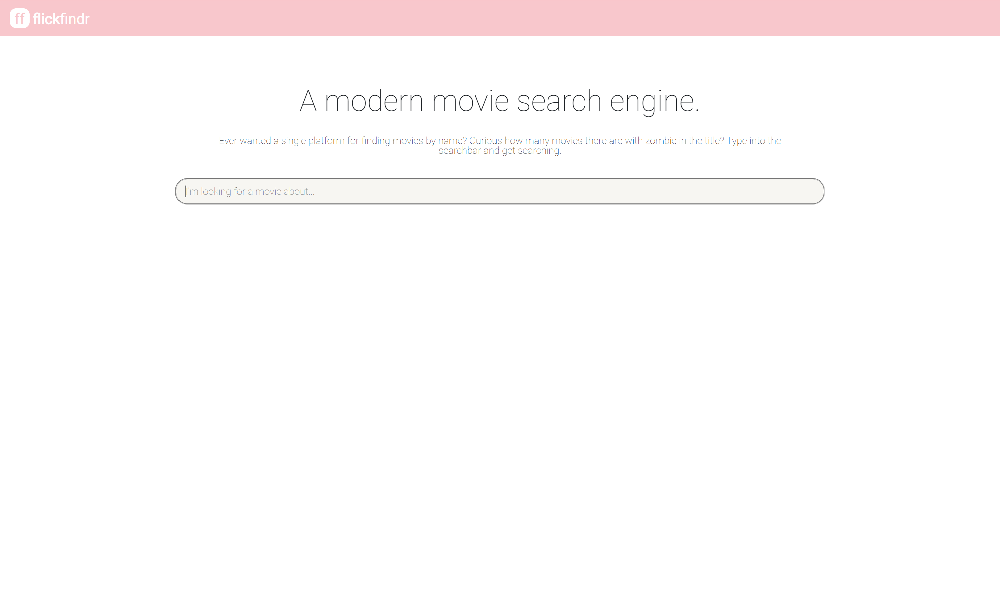
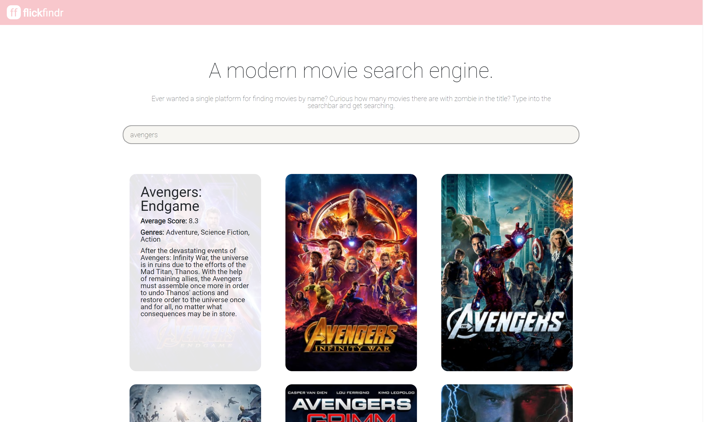

# flickfindr - a movie search engine

flickfindr is a movie search engine which allows for users to type in search terms and receive corresponding movie results, which are displayed with relevant information such as the poster image (if it exists), title, ratings, genre, and description. It accomplishes this by interfacing with the "The Movie Database (TMDb)" API, sending requests to the API and displaying select movie information in a formatted manner, as displayed below in screenshots. 

The website is currently hosted at https://flickfindr.netlify.app/, so check it out and play around with it!

## Technologies Used

HTML, CSS, React JS

## Setup

To run this code locally on your own machine, you will need to provide a config.json file inside the src directory, with an object containing key "apiKey" and value your TMDb API key. You will also need to uncomment/comment out the appropriate sections indicated at the beginning of index.js and apiVariables.js - the version of the code hosted here on Github obtains apiKey from preset environment variables in Netlify, but to run the code locally, you will want to provide apiKey from your own config.json file.

## Screenshots

On loading, the following screen is displayed: 

One can then enter search terms into the search bar, which dynamically updates the content displayed to fit search results corresponding to given input terms, as shown below:

The movie displays consist of a poster image (or a default image if there is no poster image available) and a set of text descriptions regarding the movie which are displayed when the user hovers over the given poster image, as displayed below: 

## Future Directions

There are a number of potential features to add in future versions of this project. The TMDb API provides many additional possible parameters for its API calls, including whether to include adult content and different language/region options for movie results. One potential next step would be to build an additional form component which allows users to toggle these settings - currently, searches do not include adult content and only search for results in English.

Another potential future step would be to add other related content to the MovieDisplay content, for example, potentially displaying related clips (eg trailers) from movies where applicable. These could be obtained from the TMDb API and an additional button could be attached to the MovieDisplay component which would allow for the display of such videos, where applicable.

## Credits

This project was bootstrapped with [Create React App](https://github.com/facebook/create-react-app). React-paginate was used to create the pagination feature, and the styling for the pagination menu was borrowed from https://medium.com/how-to-react/create-pagination-in-reactjs-e4326c1b9855. Bootstrap 4 styling was used for styling the navbar.
